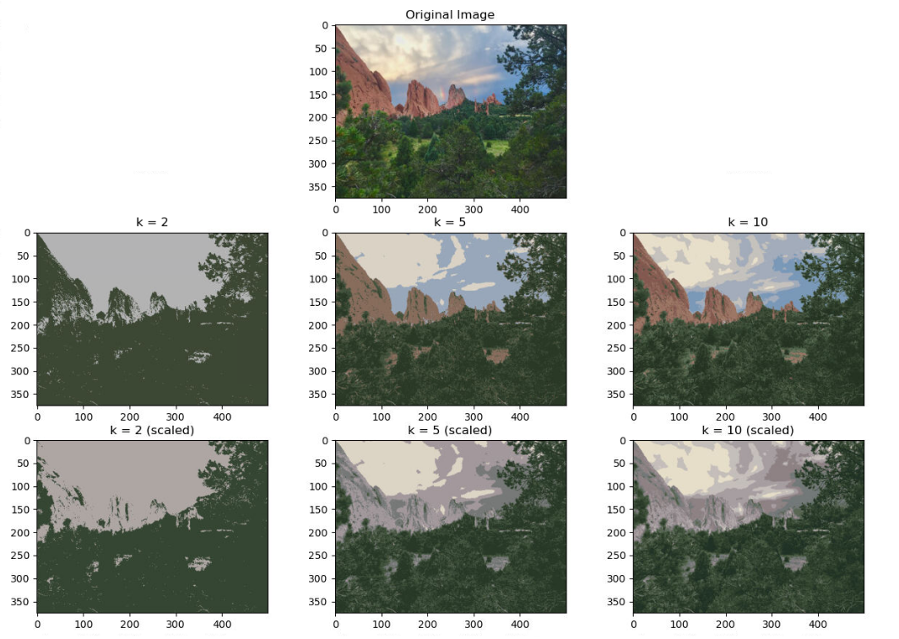
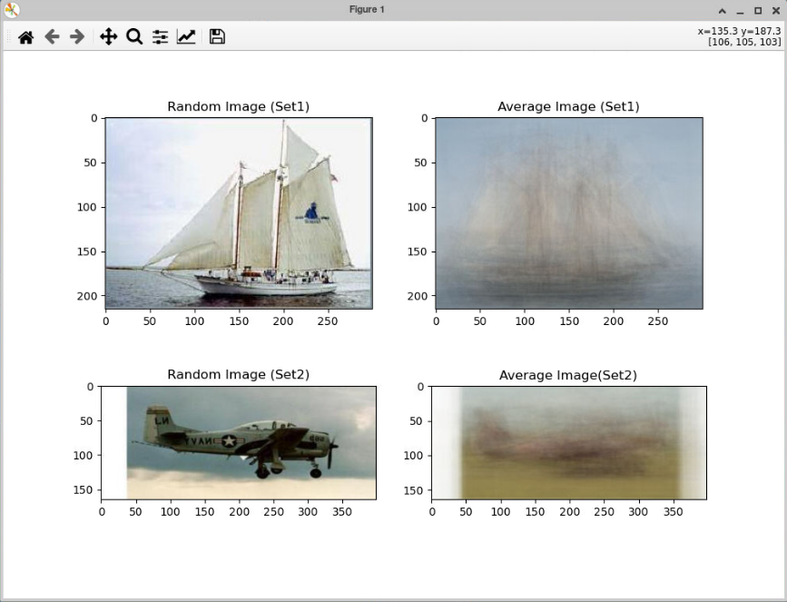
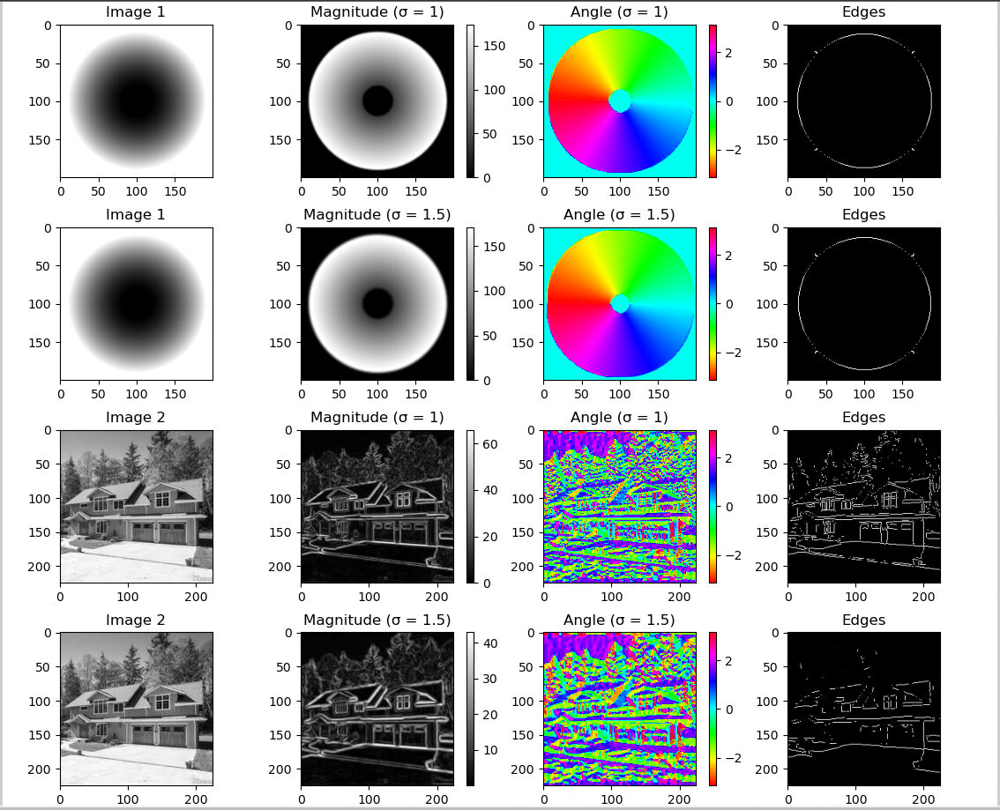
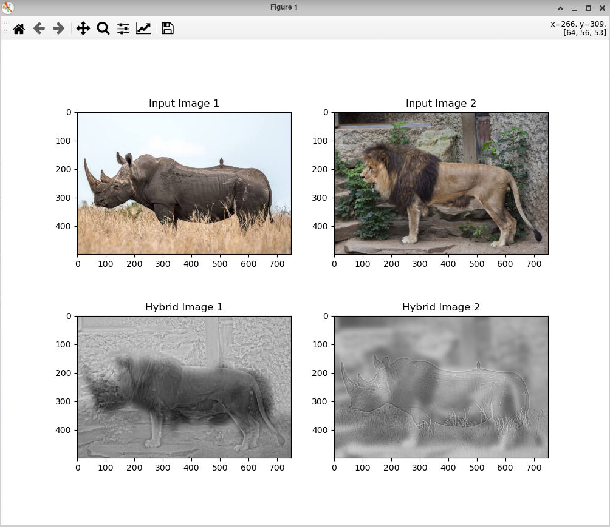
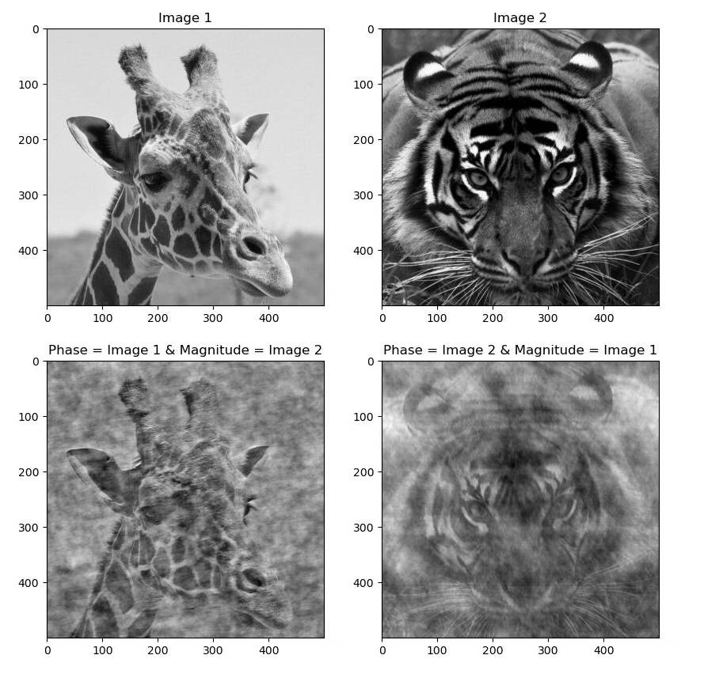
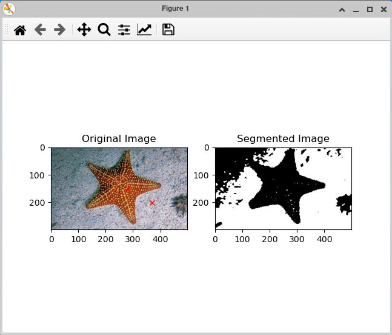
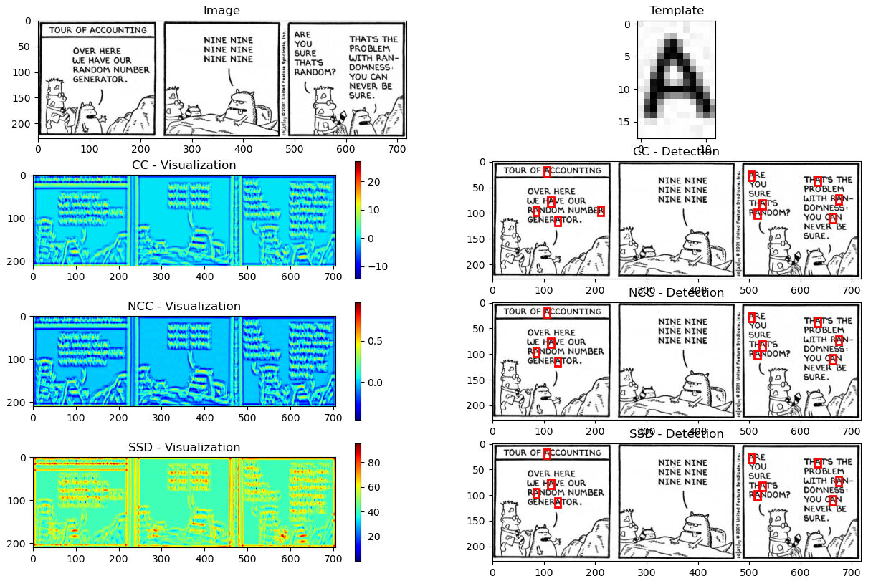
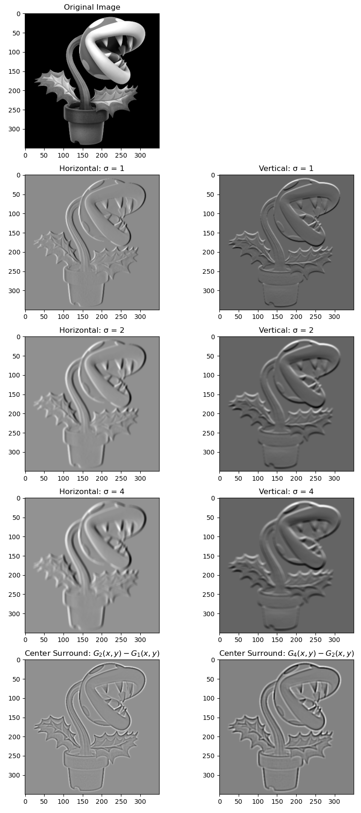

# Python Image Manipulation
This is a compilation of programs to practice and understand image manipulate using Python

## Technologies
The programs in this project were run using the following:
* Python 3.8
* X11

## Setup
After cloning or forking the repository, you can run any of the Python programs through the command line in the below manner:
1. You will want to `cd` into the repository
2. Run the Python file desired
   - An example of this would be `python3 hybridize_images.py`

## Output
### Color Quantization

### Create Average Image

### Edge Detection

### Hybridize Images

### Maze Solver

### Phase Magnitude Combination

### Segmentation MRF

### Template Detection

### Texture Modeling

